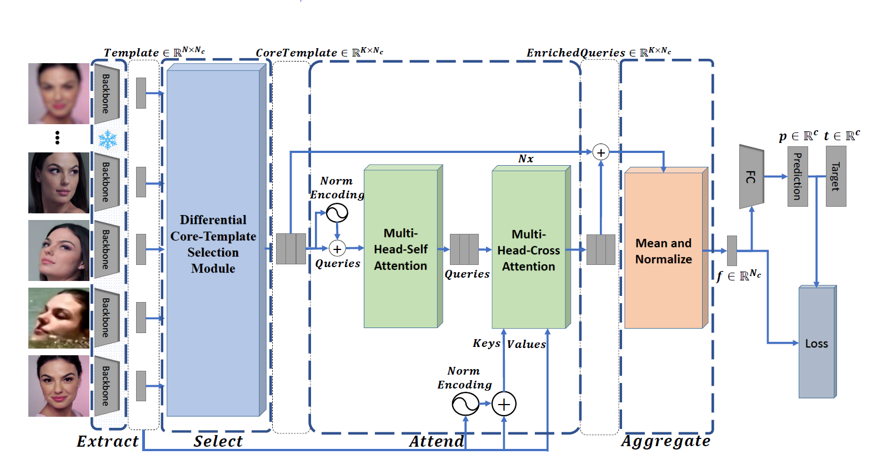

# FaceCoresetNet: Differentiable Coresets for Face Set Recognition

Official github repository for FaceCoresetNet: Differentiable Coresets for Face Set Recognition


> Abstract: In set-based face recognition, we aim to compute the most discriminative descriptor from an unbounded set of images and videos showing a single person. A discriminative descriptor balances two policies when aggregating information from a given set. The first is a quality-based policy: emphasizing high-quality and down-weighting low-quality images. The second is a diversity-based policy: emphasizing unique images in the set and down-weighting multiple occurrences of similar images as found in video clips which can overwhelm the set representation.
This work frames face-set representation as a differentiable coreset selection problem. Our model learns how to select a small coreset of the input set that balances quality and diversity policies using a learned metric parameterized by the face quality, optimized end-to-end. The selection process is a differentiable farthest-point sampling (FPS) realized by approximating the non-differentiable Argmax operation with differentiable sampling from the Gumbel-Softmax distribution of distances. The small coreset is later used as queries in a self and cross-attention architecture to enrich the descriptor with information from the whole set. Our model is order-invariant and linear in the input set size.
We set a new SOTA to set face verification on the IJB-B and IJB-C datasets. Our code is publicly available \footnote{\url{https://github.com/ligaripash/FaceCoresetNet/}}.





# Installation and Preparation

## 1. Environment
We use pytorch (1.10.0) in our experiments.
```
pip install -r requirements.txt
```

## 2. Pretrained Models
We release the FaceCoresetNet model pretrained on AdaFace backbone. 
The backbone is trained on WebFace4M dataset. 
And FaceCoresetNet is trained on a subset of WebFace4M dataset. 

- Pretrained FaceCoresetNet model:  [FaceCoresetNet.pth](https://drive.google.com/file/d/19cBIRF06ALgbeKXLR1B2h4aNrHj3d9Lf/view?usp=sharing)

Place FaceCoresetNet.pth under `pretrained_models/`
```
pretrained_models/
├── FaceCoresetNet.ckpt                         
```
# Evaluation

### IJBB and IJBC

For evaluation with IJBB/IJBC you may download the related files from. 
- [InsightFace IJB Dataset](https://github.com/deepinsight/insightface/tree/master/recognition/_evaluation_/ijb) or
- [Download](https://forms.gle/7zURRo2tca96ZKyf6) for convenience, here is an additional link we provide.

Place the downloaded files in `<DATA_ROOT>`, i.e
```
<DATA_ROOT>
└── IJB
    ├── aligned (only needed during training)                                                                                                                      │➜  ffhq mv FFHQ_png_512.zip /hddata/data/ffhq/
    └── insightface_helper
        ├── ijb                                                                                                                             │➜  ffhq mv FFHQ_png_512.zip /hddata/data/ffhq/
        └── meta        
```

For faster validation please download the IJB AdaFace backbone features:
- [IJBB-AdaFace-Backbone-Features](https://drive.google.com/file/d/1cPCzGc3mFaJnTW7wRLu_lGTeHcyipNxf/view?usp=drive_link)
- [IJBC-AdaFace-Backbone-Features](https://drive.google.com/file/d/1tJwOcUj1B9Cip7TYwaZThL3YZrLM37X1/view?usp=sharing)

Please place both these files in the directory: validation_IJBB_IJBC

```
validation_IJBB_IJBC/
├── IJBB-AdaFace-Backbone-Features.pickle
└── IJBC-AdaFace-Backbone-Features.pickle                  
```

Refer to the below code for evaluation.
```bash
1. Update eval.sh with your DATA_ROOT
2. bash ./eval.sh  
```


# Training from scratch

## WebFace4M Subset (as in paper)
The model was trained on a WebFace4M subset that can be downloaded here [AdaFace4M_subset](https://drive.google.com/file/d/1LuhyxoTdMoVTsrlmZ5_F26Oia3bXsIpu/view?usp=share_link).

- Get pretrained face recognition model backbone
  - AdaFace trained on WebFace4M [AdaFaceWebFace4M.ckpt](https://drive.google.com/file/d/19AfGaGZjDqwPQR00kck0GBknePmQOFnU/view?usp=share_link)
  - Place the files under `pretrained_models/`


For training script, refer to
```bash
cd FaceCoresetNet
bash ./train.sh  # DATA_ROOT has to be specified. 
```

